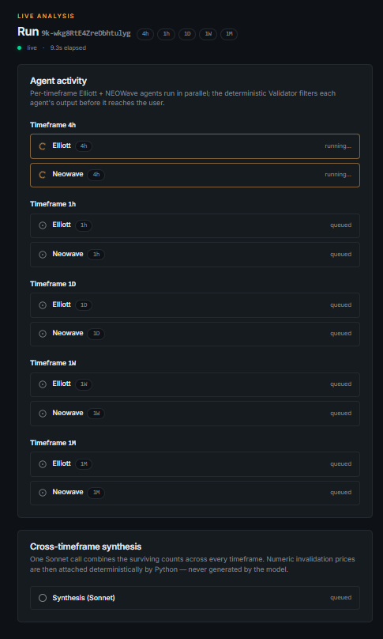
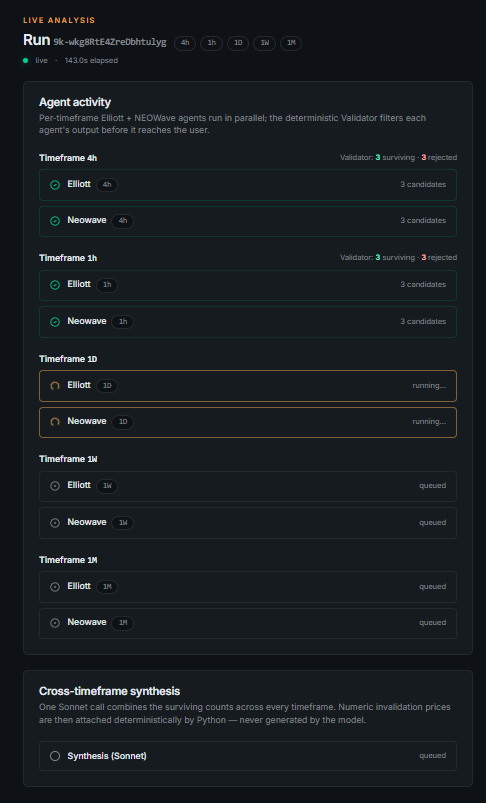
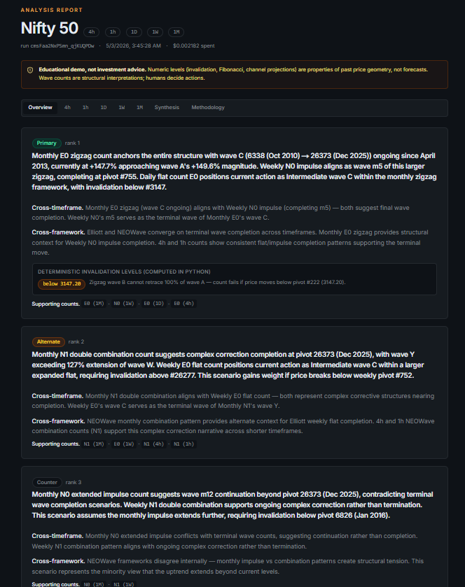
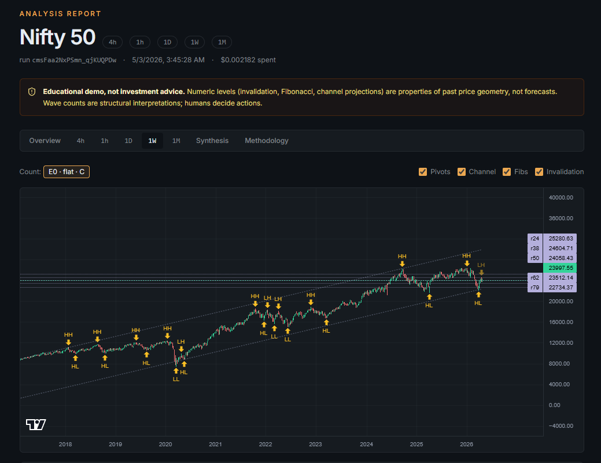
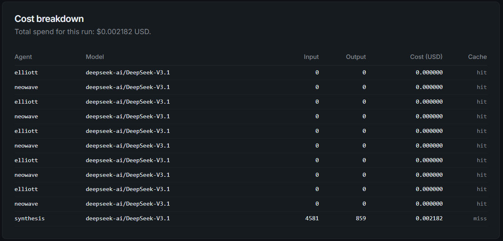

# wave-agent

Multi-agent Elliott Wave + NEOWave structural analysis for OHLCV time series.

> ## ⚠️ Disclaimer
>
> **This project is an educational and engineering demo. It is NOT investment advice. It is NOT a trading recommendation.**
>
> wave-agent proposes structural interpretations and deterministic levels. **Humans decide actions.** The system does not predict prices, does not signal entries or exits, and does not estimate probabilities of future moves. Any numeric output (invalidation levels, Fibonacci zones, channel projections) is a property of the geometry of past price — not a forecast.
>
> No language anywhere in this project may be read as "buy", "sell", "target price", or "recommended action". Trading or investing decisions taken on the basis of this output are entirely the responsibility of the person taking them.

---

## What it does

You upload OHLCV CSVs for one instrument across one or more timeframes (e.g. monthly, weekly, daily, 4h, 1h). The system:

1. **Deterministic preprocessing** — parses each CSV, detects pivots (custom ZigZag), labels swings (HH/HL/LH/LL), fits parallel channels, computes Fibonacci retracement / extension / projection / time ratios, and produces a compact `StructureSummary` per timeframe.
2. **Per-timeframe LLM agents (fast tier)** — an Elliott Wave agent and a NEOWave agent each propose 2–3 ranked candidate counts on the structured summary. The agents never see raw OHLCV.
3. **Deterministic Validator** — Python rule checks (Prechter for Elliott, Neely for NEOWave) reject counts that violate hard structural rules. Surviving counts are scored.
4. **Synthesis agent (smart tier)** — a single cross-timeframe, cross-framework call ranks the top 3 overall scenarios and lists their deterministic invalidation levels and Fibonacci confluence zones.
5. **Report** — interactive charts (Lightweight Charts), wave annotations, channels, fibs, invalidation lines, and a methodology page that documents what was computed deterministically vs. interpreted by an LLM.

The intellectual core is the deterministic / LLM split. **Python computes everything that can be computed. LLMs only do interpretive work, on pre-summarised inputs.** Numbers (invalidation levels, Fibonacci targets, channel projections) are never generated by an LLM — they are computed in Python and rendered next to LLM rationale that references them.

---

## Screenshots

All shots below are from a single live run on monthly NIFTY 50 (1990–2026, 430 bars) using DeepSeek-V3.1 via DeepInfra. **Total spend for the run: $0.003150** across three live LLM calls. Subsequent runs on the same data hit the agent cache and complete in seconds at zero cost.

**1. Upload.** Drop up to 8 CSVs in one go — one per timeframe. The example below shows a five-timeframe NIFTY 50 upload (4h / 1h / 1D / 1W / 1M, totalling 380 KB). Per-file timeframe selector (no auto-detection — that's brittle around weekends/holidays). Inline validation with actionable error messages; missing `volume` and aliased `Date` columns are accepted with warnings.



**2. Live analysis.** Per-timeframe Elliott + NEOWave agents run in parallel. Events stream over WebSocket; the page shows queued → running → completed transitions for each agent, plus the synthesis stage. Auto-redirects to the report on completion.



**3. Report — Overview.** Ranked scenarios from the cross-timeframe synthesis agent. Each scenario references real pivot indices from the data, identifies cross-framework agreement (Elliott vs NEOWave), and surfaces the **deterministic invalidation level** computed in Python — the LLM never generates these numbers.



**4. Report — per-timeframe chart.** Interactive Lightweight Charts with pivot markers (HH / HL / LH / LL), channel lines, Fibonacci retracements, and a clearly-marked invalidation level. Toggle between surviving counts via the count selector (here: `E0` impulse wave 5, `E1` zigzag wave C). Below the chart: the active count's wave-by-wave structure (each wave mapped to its start/end pivot indices) and the **rule-compliance scorecard** — every Elliott rule (EW-H-1 through EW-H-3, EW-S-1, EW-S-2) checked against this count and shown explicitly. Bottom panel: deterministic structural snapshot (430 bars, 58 pivots, +43.5° channel slope, ATR(14) = 1491, etc.).



**5. Report — Methodology.** Documents the deterministic-vs-LLM split, lists every encoded rule, and itemises the per-agent cost breakdown. The cost line for this run: **elliott $0.001051 + neowave $0.000944 + synthesis $0.001155 = $0.003150 total** on DeepSeek-V3.1. This page is the audit trail anyone reviewing the project should land on.



---

## Get running in 3 minutes

You need Docker Desktop (or Docker Engine + Compose v2) and an API key from one of: **DeepInfra** (cheapest, ~$0.003/run, default), Anthropic, or OpenAI.

```bash
# 1. Clone
git clone https://github.com/<you>/wave-agent.git
cd wave-agent

# 2. Configure
cp .env.example .env
# Edit .env: set LLM_PROVIDER and the matching key
#   LLM_PROVIDER=deepinfra   + DEEPINFRA_API_KEY=...   (recommended)
#   LLM_PROVIDER=anthropic   + ANTHROPIC_API_KEY=...
#   LLM_PROVIDER=openai      + OPENAI_API_KEY=...

# 3. Up
docker compose up --build
```

When the stack is healthy:

| Service     | URL                          |
| ----------- | ---------------------------- |
| Frontend    | http://localhost:3000        |
| Backend API | http://localhost:8000/docs   |
| Health      | http://localhost:8000/health |

Sample CSVs are committed under [`samples/`](samples/) — you can use them to try the upload flow without supplying your own data.

To bring it down:

```bash
docker compose down            # keep volumes
docker compose down --volumes  # wipe postgres + redis state
```

---

## Architecture at a glance

```
   CSV uploads ──► preprocessing (deterministic Python)
                            │
                            ▼
                   StructureSummary  ◄──── ~80–150 tokens / timeframe
                            │
        ┌───────────────────┼───────────────────┐
        ▼                   ▼                   ▼
  Elliott Agent       NEOWave Agent        (per timeframe,
   (fast tier)         (fast tier)         asyncio.gather)
        │                   │
        └─────► Validator (Python rules) ◄─────┘
        │  + pivot decoration: #244 → "6092 (Nov 2010)"  │
                            │
                            ▼
                  Synthesis Agent (smart tier)
                            │
                            ▼
                     AnalysisReport
```

Per-run cost depends on provider — see the Token economics section below. Real measured cost on the committed monthly NIFTY dataset is **$0.003 – $0.005 with DeepInfra/DeepSeek-V3.1**. Identical structures + identical agent + identical model produce a cache hit and skip the LLM call entirely.

See [ARCHITECTURE.md](ARCHITECTURE.md) for the deterministic-vs-LLM split, and [ELLIOTT_RULES.md](ELLIOTT_RULES.md) for the rules encoded in `elliott_rules.py` / `neowave_rules.py` with citations to source texts.

---

## Tech

**Backend:** Python 3.12 · FastAPI · PydanticAI · Pydantic v2 · pandas · numpy · scipy · Postgres 16 · Redis · structlog · WebSockets

**Frontend:** Next.js 15 (App Router, TypeScript strict) · Tailwind v4 · shadcn/ui · Lightweight Charts · Framer Motion · TanStack Query · Zod · react-dropzone

**Infra:** docker-compose · Alembic · pytest · ruff · mypy strict

---

## Project status

This is a public showcase repo. The scope is fixed: CSV input only, no live data feeds, no auth, no portfolio, no signals.

```
Step 1  ✅ Repo scaffolding (docker-compose, postgres + redis healthy)
Step 2  ✅ Backend skeleton (FastAPI /health + alembic migrations)
Step 3  ✅ CSV upload endpoint with strict validation
Step 4  ✅ Preprocessing pipeline → StructureSummary  (~130 token NIFTY-1D summary verified)
Step 5  ✅ elliott_rules.py + neowave_rules.py        (7 hard EW + 2 soft + 3 hard NW encoded)
Step 6  ✅ Elliott Wave Agent (Haiku)                 (PydanticAI; TestModel-backed unit tests)
Step 7  ✅ NEOWave Agent (Haiku)                      (parallel asyncio.gather with Elliott)
Step 8  ✅ Validator wiring                           (rule checks → invalidation levels)
Step 9  ✅ Synthesis Agent (Sonnet)                   (single Sonnet call; deterministic level hydration)
Step 10 ✅ Orchestrator end-to-end                    (~4s on real 740-row NIFTY 1D)
Step 11 ✅ WebSocket streaming                        (POST /analyze + GET /runs/{id} + WS /ws/runs/{id})
Step 12 ✅ Upload page (react-dropzone)
Step 13 ✅ Live analysis page                         (animated agent rows, auto-redirect on completion)
Step 14 ✅ Report page (Lightweight Charts)           (tabs, count toggles, channel/fib/invalidation overlays)
Step 15 ✅ Polish                                      (next-themes light/dark, error.tsx + not-found.tsx)
Step 16 ✅ Docs (this README, ARCHITECTURE.md, ELLIOTT_RULES.md)
Step 17 ✅ Final smoke test                           (fresh `docker compose up` → upload → analyze → report)
```

**Test summary.** 58 unit tests passing across preprocessing, rules, agents, validator, orchestrator, and API. WebSocket streaming verified end-to-end via `backend/scripts/smoke_ws_run.py` against the live container.

**LLM live checkpoints.** Steps 6, 9, and 14 each define a "paste real output" checkpoint that requires `ANTHROPIC_API_KEY` set in `.env`. Without a key, every agent call falls back to PydanticAI's `TestModel` so the entire pipeline runs end-to-end at $0.00 — useful for the structural / engineering verification, but the prompt-quality verification needs a key.

---

## Token economics

Token-frugality is a design goal, not a side effect.

| Stage                       | Tier  | Typical input | Typical output |
| --------------------------- | ----- | ------------- | -------------- |
| Per-timeframe Elliott agent | fast  | ~1,500 tokens | ~600 tokens    |
| Per-timeframe NEOWave agent | fast  | ~1,500 tokens | ~600 tokens    |
| Synthesis agent             | smart | ~2,500 tokens | ~600 tokens    |

A single-timeframe analysis runs 2 fast-tier calls + 1 smart-tier call. Real measured cost on the committed 36-year NIFTY 50 monthly dataset (`samples/NIFTY_1M.csv`):

| Provider     | Fast tier             | Smart tier         | Real run cost (1×1M) |
| ------------ | --------------------- | ------------------ | -------------------- |
| `deepinfra`  | DeepSeek V3.1         | DeepSeek V3.1      | **$0.003 – $0.005**  |
| `openai`     | gpt-4o-mini           | gpt-4o             | $0.01 – $0.03        |
| `anthropic`  | Claude Haiku 4.5      | Claude Sonnet 4.6  | $0.02 – $0.05        |

The `cost_breakdown` field on every run response itemises the spend per agent. Identical inputs hit a Redis-backed cache and skip the LLM entirely on subsequent runs.

A hard cap (`MAX_RUN_COST_USD`, default $0.50) rejects runs whose **estimated** cost exceeds the threshold before any LLM call is made — so a pathological 50,000-row file cannot blow up the bill.

### LLM provider options

`LLM_PROVIDER` selects which API the agents call. Three providers are wired up — each uses the same prompts, schemas, and validator pipeline; only the model and the endpoint change.

| Provider     | Default fast tier     | Default smart tier  | API key env           |
| ------------ | --------------------- | ------------------- | --------------------- |
| `deepinfra`  | DeepSeek V3.1         | DeepSeek V3.1       | `DEEPINFRA_API_KEY`   |
| `openai`     | gpt-4o-mini           | gpt-4o              | `OPENAI_API_KEY`      |
| `anthropic`  | Claude Haiku 4.5      | Claude Sonnet 4.6   | `ANTHROPIC_API_KEY`   |

**DeepInfra (DeepSeek, Kimi, Llama, Mistral, GLM, …).** DeepInfra exposes an OpenAI-compatible endpoint that fronts dozens of open-weights models. Sign up at [deepinfra.com](https://deepinfra.com), find the exact model name in their [model catalog](https://deepinfra.com/models), then in `.env`:

```bash
LLM_PROVIDER=deepinfra
DEEPINFRA_API_KEY=...

# Pick any DeepInfra-served model. Examples:
DEEPINFRA_MODEL_FAST=deepseek-ai/DeepSeek-V3.1
DEEPINFRA_MODEL_SMART=deepseek-ai/DeepSeek-V3.1

# Or run Kimi (Moonshot) instead — same DeepInfra path, just a different model id:
# DEEPINFRA_MODEL_FAST=moonshotai/Kimi-K2-Instruct
# DEEPINFRA_MODEL_SMART=moonshotai/Kimi-K2-Instruct

# Adjust pricing if your model has different per-Mtok rates than the defaults
# (which are tuned for DeepSeek V3.x — Kimi and bigger Llamas cost more):
# DEEPINFRA_INPUT_PRICE_PER_MTOK=0.55
# DEEPINFRA_OUTPUT_PRICE_PER_MTOK=2.20
```

The `cost_breakdown` field on every run response shows the actual spend, regardless of provider or model. The cost cap reads `DEEPINFRA_*_PRICE_PER_MTOK` so keep those in sync with whatever model you've selected and DeepInfra's current rates.

If no key is set, every agent call falls through to PydanticAI's `TestModel` (zero spend, schema-correct stubs) — useful for the structural / engineering verification, but the prompt-quality verification needs a real key on any provider.

---

## Caching

Cache key: `SHA-256(StructureSummary JSON + agent name + model name)`.
TTL: 7 days (structures don't change once data is fixed).
Cache hits are returned instantly with no LLM call. Re-running the same analysis is free.

---

## License

MIT. See [LICENSE](LICENSE).

---

> **Reminder:** wave-agent is an engineering demo. It does not give investment advice and does not predict prices. Every numeric level shown in the UI is a property of past price geometry, not a forecast.
